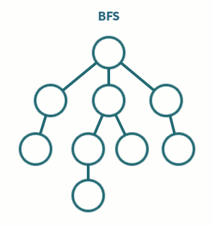

# Breadth First Search (BFS)
Performed on graphs and trees, BFS starts at a root node and travels through the structure one level at a time. 
The adjacent nodes are added to the end of a First-In-First-Out queue, and at each iteration, the front of the queue is popped to get the next node to handle.
In this way, each level from the root is added to the queue in batches, resulting in a row-by-row search.

BFS is useful for:
* finding friends of friends
* finding the shortest path from point A to B

    
     
    <em>GIF from <a href="https://medium.com/analytics-vidhya/a-quick-explanation-of-dfs-bfs-depth-first-search-breadth-first-search-b9ef4caf952c">Medium</a></em>

## Step-by-Step

1. Your function signature should include:
    * the root of the tree, or starting vertex for a graph
    * the target value to search for
2. Initialize a **queue with the root** of the tree/starting graph node as the only element
    * If using a graph, initialize a **data structure to mark if the node was visited**, be it a hash map, set, etc.
3. Initialize a **loop that runs until the queue is empty**
4. **Pop the first element** of the queue to get the node/vertex to handle
    * If using a graph, **mark the element as visited**
5. If the element **contains the target value**, return a reference to the node, or True, depending on function goals
6. **Add the children nodes**/unvisited adjacent verticies to the end of the queue
7. If the **entire tree/graph was searched without finding the target**, return None or False depending on function goals

## Complexities

**Time Complexity**: `O(n)`, where n is the number of nodes in the tree, or `O(V + E)`, where V is the number of vertices and E is the number of edges in the graph
- Each node is visited at most once, and the entire tree/graph might be searched

**Space Complexity**: `O(n)` - The entire tree/graph can be loaded into the queue at once