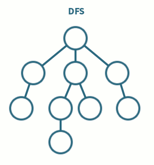

# Depth First Search (DFS)
Performed on graphs and trees, DFS starts at a root node and travels through the structure as far into the structure as possible. 
For trees, at each node, the left subtree is managed first, and then the current node is proceeded, ending with the right node being processed.
For graphs, the first node that is found is managed immediately, and becomes the next node to process.
In this way, The tree/graph is searched by going down the height of it first.

DFS is useful for:
* cycle detection
* finding the shortest path from point A to B

    
     
    <em>GIF from <a href="https://medium.com/analytics-vidhya/a-quick-explanation-of-dfs-bfs-depth-first-search-breadth-first-search-b9ef4caf952c">Medium</a></em>

## Step-by-Step

1. Your function signature should include:
    * the root of the tree, or starting vertex for a graph
    * the target value to search for
2. Check to see if the given node is None, in which case return False or None, depending on function goals
    * If using a graph, initialize a **data structure to mark if the node was visited**, be it a hash map, set, etc., in a manner accessible by the DFS function
3. Perform a recursive call on the left node
4. Check the current node's value against the target, return True or the node, depending on function goals
    * If using a graph, **mark the element as visited**, and only process current node if it wasn't visited
5. Perform a recursive call on the right node
6. At the end of the function, if the **entire tree/graph was searched without finding the target**, return None or False depending on function goals

## Complexities

**Time Complexity**: `O(n)`, where n is the number of nodes in the tree, or `O(V + E)`, where V is the number of vertices and E is the number of edges in the graph
- Each node is visited at most once, and the entire tree/graph might be searched

**Space Complexity**: `O(nx)` - The entire tree/graph can be loaded into the stack at once