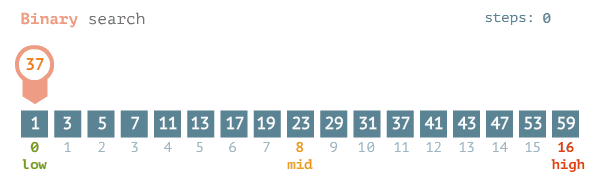

# Binary Search
Performing a binary search on a list of elements requires first that the list is sorted, traditionally in ascending order. 
This search uses the sorted property of the list to its advantage, removing half of the remaining search area from consideration at every step.
This solution can be implemented iteratively, with variables for the left and right indices of the search area, or recursively, with the recursive calls offering the decreasing bounds of the search area.

    
     
    <em>GIF from <a href="https://afteracademy.com/blog/binary-search">AfterAcademy</a></em>

## Step-by-Step

### Iterative

1. Your function signature should accept:
    * the list of elements to search (must be sorted)
    * the target element to find
2. Set **left and right index bounds** of search area to 0 and the length of the list minus 1, respectively
3. Begin a loop that **ends once the left bound supersedes the right** bound
4. Calculate the **middle of the search area** by averaging the left and round bounds and flooring the answer
5. Check the **middle element against the target** value
    * If the middle element **is the target**, return the middle index
    * If the middle element is **greater than the target**, then move your search to the left (smaller values than the middle element) by setting the right bound to one before the middle index
    * Otherwise, the middle element is **less than the target**, so move your search to the right (larger values than the middle element) by setting the left bound to one after the middle index
6. Steps 4 and 5 will repeat, with the adjustment of the left or right bounds influencing the recalculation of the middle index at the beginning of the loop, reducing the search area. Each iteration will see the search area reduced to half of its previous step.
7. If the loop completes, then the target was not found, so you return -1

### Recursive

1. Your function signature should accept:
    * the list of elements to search (must be sorted)
    * the target element to find
    * the left bound of the search range
    * the round bound of the search range
2. Do a bounds check for the failure base case, indicating the target is not present in the list, by returning -1 if the left bound supersedes the right bound.
3. Calculate the **middle of the search area** by averaging the left and round bounds and flooring the answer
4. Check the **middle element against the target** value
    * If the middle element **is the target**, return the middle index
    * If the middle element is **greater than the target**, then move your search to the left (smaller values than the middle element) by making a recursive call with the right bound argument set to one before the middle index
    * Otherwise, the middle element is **less than the target**, so move your search to the right (larger values than the middle element) by making a recursive call with the left bound argument set to one after the middle index
5. Steps 3 and 4 will repeat, with the adjustment of the left or right bounds influencing the recalculation of the middle index at the beginning of the function, reducing the search area. Each recursive call will see the search area reduced to half of its previous step.

## Complexities

**Time Complexity**: `O(log n)`
- At each step, the area that is searched is halved, resulting in a logarithmic 

**Space Complexity**: 
* Iterative: `O(1)` - No extra space is allocated
* Recursive: `O(log n)` - The recursive call stack can be at most `log n` calls tall

## Common Related Data Structures
* List/Array
* Binary Search Tree (BST)