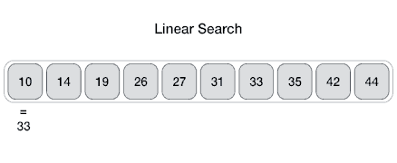

# Linear Search
A linear search can be done on any list, either sorted or unsorted. It is a straightforward search where every element of the list is checked sequentially until the target value is found, or until there are no more elements to search and the target is not found in the list.

    
     
    <em>GIF from <a href="https://www.tutorialspoint.com/data_structures_algorithms/linear_search_algorithm.htm">TutorialsPoint</a></em>

## Step-by-Step

1. Your function signature should include:
    * the list to search
    * the target value to search for
2. Declare a loop to iterate through the list from beginning to end
3. At each iteration, check if the current element is the target, and return the index if it is
4. If the end of the loop is reached and no index was returned, return -1 to indicate that the element was not found in the list

## Complexities

**Time Complexity**: `O(n)`
- The list is searched sequentially from beginning to end, potentially searching every element once

**Space Complexity**: `O(1)`
- No extra memory needs to be allocated to complete this search

## Common Related Data Structures
* List/Array
* Linked List