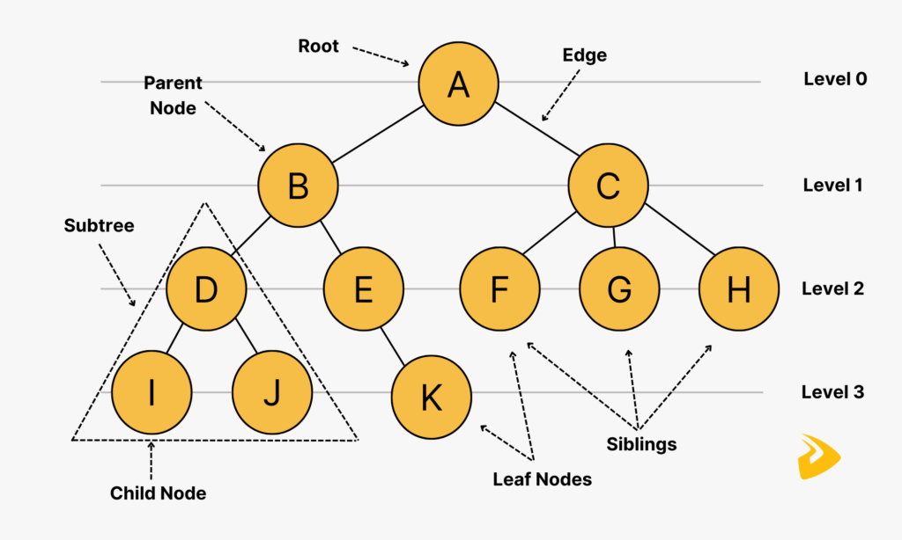

# Trees
A Tree is a chain of nodes arranged in a hierarchical structure, with a single "root" node upon which all nodes originate from, either directly or indirectly.
It gets its name for its resemblance to a tree when the Tree is turned upside down, hence why the origin node is called the "root".
Each node of the Tree can have any number of children nodes.

    
     
    <em>Image from <a href="https://www.designveloper.com/blog/tree-data-structure/">Designveloper</a></em>

## Traversing the Data
To traverse a Tree, given its non-linear structure, there are multiple approaches.
Most notably, there are breadth-first and depth-first approaches, each with their own use cases.

A breadth-first approach starts at the root of the tree and handles all nodes at a given depth level before handling the next depth level.
This is most often implemented with a queue, starting at the root, with all direct children of the root being added to the end of the queue.
At each iteration, the top of the queue is popped off to be handled, adding each of its children to the end of the queue, until the Tree is fully searched.

A depth-first approach starts at the root of the tree and handles the leftmost node first, performing a recursive call to immediately handle the leftmost node.
This relies on recursion and the recursive call stack by extension to handle where in the Tree the traversal is.

## Variations
* Binary Tree - a Tree where nodes can have at most 2 children
* N-ary Tree - a Tree where nodes can have at most n children