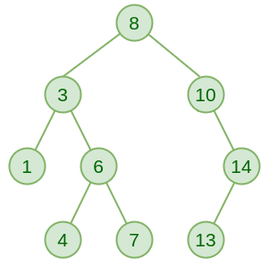

# Binary Search Tree
A Binary Search Tree (BST) is a variation of a Binary Tree in which every left subtree contains elements that are less than or equal to a given node, and every right subtree contains elements that are greater than the given node.

    
     
    <em>Image from <a href="https://www.geeksforgeeks.org/dsa/binary-search-tree-data-structure/">GeeksForGeeks</a></em>

## Traversing the Data
A BST is traversed in the same way a Binary Tree is traversed.
However, they are generally used specifically for their optimized searching properties, so typically they are traversed to find an element, rather than simply print nodes in the structure.
Finding elements can be done using the same methods as traversing Binary Trees, but instead of printing values and returning nothing from the functions themselves, either a reference to the located node or a True value is returned. 